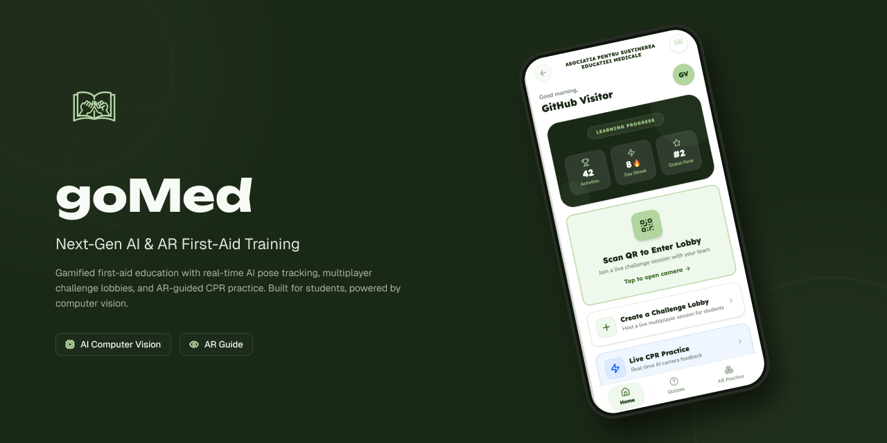

# goMed

A gamified first-aid and CPR training web application utilizing client-side computer vision, augmented reality, and real-time multiplayer lobbies.




---

## Core Features

### Client-Side CPR Pose Tracking
The application uses Google's MediaPipe Pose detection to provide real-time posture and rhythm tracking during CPR practice. The analysis runs entirely on the client's device using the webcam, tracking shoulder and wrist alignment to calculate compression depth, arm lock angles, and cadence (100–120 BPM) with zero network latency.

<!-- [INSERT IMAGE: CPR_HUD.png] -->

### Augmented Reality (AR) & 3D Interactive Models
Users can project 3D anatomical models and CPR training dummies into their physical environment using WebXR / QuickLook (`.glb` and `.usdz`). These models provide spatial context and interactive step-by-step guidance for key first-aid procedures:
- **Cardiopulmonary Resuscitation (CPR)**

<!-- [INSERT IMAGE: AR_Dummy.png] -->

### Synchronous Multiplayer Challenge Lobbies
Educators can host synchronous, multiplayer quiz lobbies for classroom settings. Students join in real-time via QR code scanning or 6-character room codes.

<!-- [INSERT IMAGE: Lobby_Quiz_Screen.png] -->

### Bilingual Localization (Romanian & English)
The entire application features native dual-language localization (**Română** & **English**):
- **11 Clinical Modules:** 100 clinically verified questions across both languages.
- **Studio AI Audio Coach:** High-definition voice prompts generated via ElevenLabs for CPR cadence coaching and posture corrections in both Romanian and English.

### Gamification and Progression
A responsive dashboard tracks user learning curves across modules, featuring:
- Global leaderboards powered by database RPC windows.
- Continuous day streaks and activity counters.
- Dynamic XP awards and accuracy metrics.

<!-- [INSERT IMAGE: Dashboard.png] -->

---

## Technical Architecture

### Computer Vision (MediaPipe & WASM)
To ensure zero-latency feedback during live CPR drills, pose detection is executed directly in the browser via WebAssembly. The `CameraMirrorView` component feeds video frames to the MediaPipe API, calculating vector angles to ensure the practitioner's elbows are locked straight and compressions maintain a steady 100–120 BPM rhythm.

### Real-Time Synchronization (WebSockets)
Multiplayer challenge rooms use Supabase Realtime (WebSockets) to maintain state consistency across host and student devices. Starting a session, submitting an answer, or updating participant score leaderboards happen instantly across devices.

### Database & Remote Procedure Calls (RPC)
The application relies on PostgreSQL hosted on Supabase. Custom SQL functions (RPCs) optimize complex data queries on the server:
- `get_leaderboard_context`: Computes a 5-player global rank window around the active user.
- `increment_participant_score`: Atomically updates multiplayer scores during live matches.

---

## Benchmarks & Performance Audits

The platform has been audited for performance, AI inference latency, and high-concurrency WebSocket throughput:

| Benchmark | Key Metric | Result | Detailed Report |
| :--- | :--- | :--- | :--- |
| **MediaPipe AI Inference** | Client-side frame processing latency | **~13.5 ms / frame** (30 FPS budget: < 33.3ms) | [Inference Benchmark Report](benchmarks/mediapipe-inference.md) |
| **Supabase Realtime Load Test** | 100 concurrent clients across 5 live lobbies | **0% dropped packets**, **77.07 ms avg latency** | [WebSocket Load Test Report](benchmarks/websocket-load-test.md) |
| **Google Lighthouse Audit** | Best Practices & SEO / Mobile UX | **100/100 Best Practices**, **100/100 SEO**, **87/100 Accessibility** | [Lighthouse Audit Report](benchmarks/lighthouse-audit.md) |

---

## Project Structure

```text
goMed/
├── benchmarks/                    # Performance, AI inference & load test reports
│   ├── lighthouse-audit.md        # Google Lighthouse audit results & analysis
│   ├── mediapipe-inference.md     # Client-side 30 FPS camera inference benchmark
│   └── websocket-load-test.md     # 100 concurrent bot WebSocket benchmark
├── public/                        # Static assets, models & audio clips
│   ├── assets/                    # 3D assets (.glb, .usdz) and graphic illustrations
│   ├── audio/                     # Studio voiceover audio files
│   │   ├── en/                    # English audio cues (begin, faster, slower, etc.)
│   │   └── ro/                    # Romanian audio cues (începeți, mai repede, etc.)
│   ├── google-lighthouse-results.png
│   └── robots.txt
├── scripts/                       # Database seeds, utilities & benchmark runners
│   ├── seed_bilingual_questions.sql # 100 RO & EN verified first-aid questions
│   ├── voice-generation.py        # ElevenLabs TTS generation script
│   └── websocket_load_test.js     # Multi-lobby concurrency stress test runner
├── src/
│   ├── components/                # Reusable UI components & modals
│   │   ├── layout/                # Bottom navigation bar & header layouts
│   │   └── modals/                # QR code, password reset & info modals
│   ├── hooks/                     # Custom hooks (e.g. useCameraStream)
│   ├── lib/                       # Core libraries & clients
│   │   ├── i18n/                  # Localization provider & dictionaries (ro.ts, en.ts)
│   │   ├── storage.ts             # Typed persistent localStorage manager
│   │   └── supabaseClient.ts      # Supabase client configuration
│   ├── screens/                   # Application view controllers
│   │   ├── ar/                    # AR Hub, 3D model viewers & try-on procedures
│   │   ├── auth/                  # Landing, login/signup & onboarding tutorial
│   │   ├── cpr/                   # Live camera CPR drill with real-time HUD
│   │   ├── lobby/                 # Host challenge room, QR scanner & classroom quiz
│   │   ├── main/                  # Dashboard, profile & module catalogue
│   │   └── quiz/                  # Single-player time-attack quiz gameplay
│   ├── services/                  # Business logic & background workers
│   │   ├── audioCoachQueue.ts     # Preloaded audio engine with browser fallback
│   │   ├── cprMetricsCalculator.ts# Real-time angle & compression cadence tracker
│   │   ├── mediapipePose.ts       # WASM MediaPipe pose landmarker pipeline
│   │   └── wakeLockManager.ts     # Screen wake-lock API manager
│   ├── App.tsx                    # Screen router & root context wrapper
│   └── main.tsx                   # Entry point
├── package.json
└── vite.config.js
```

---

## Running Locally

1. **Clone the repository**
   ```bash
   git clone https://github.com/asemedu/goMed.git
   cd goMed
   ```

2. **Install dependencies**
   ```bash
   npm install
   ```

3. **Configure Environment Variables**
   Create a `.env` file in the root directory and add your Supabase credentials:
   ```env
   VITE_SUPABASE_URL=your_supabase_url
   VITE_SUPABASE_ANON_KEY=your_supabase_anon_key
   ```

4. **Seed the Database**
   Open your **Supabase SQL Editor** and execute:
   - [`scripts/seed_bilingual_questions.sql`](scripts/seed_bilingual_questions.sql) to populate the 11 medical modules with 100 questions.

5. **Start the development server**
   ```bash
   npm run dev
   ```

6. **Expose for mobile testing (Optional)**
   Because camera and WebXR APIs require a secure context (`HTTPS`) or `localhost`, use a tunneling service to test on physical mobile devices:
   ```bash
   ngrok http 5173
   ```

---

## Project Credits

*Developed for interactive first-aid and resuscitation education in schools.*

> **Developers:** [Rareș Cazan](https://github.com/rarescazan30) & [Alex Fechet](https://github.com/alexf05)  
> **Project:** **Start ONG**, funded by **Kaufland Romania** through **Act for Tomorrow ONG**  
> **Implemented by:** **Asociația pentru Susținerea Educației Medicale (ASEM)**
