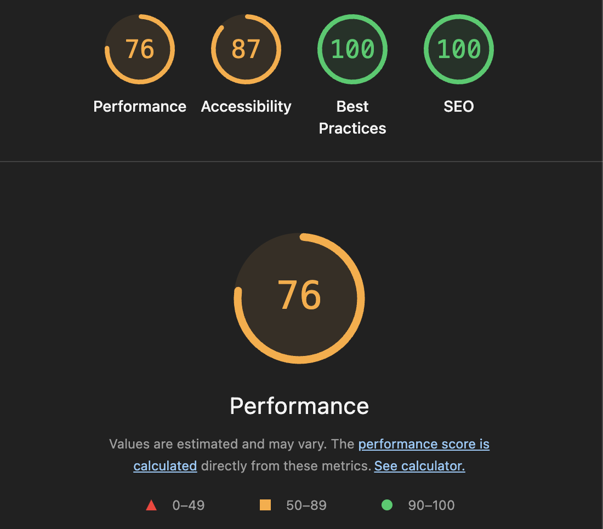

# Google Lighthouse Audit

**Date:** August 25, 2026

**Hardware Tested On:** Apple Silicon Mac (Vite Production Build)

**Methodology:** Built for production (`npm run build`), served locally via `npm run preview`, and audited via Chrome DevTools Lighthouse (Mobile Simulation) in an Incognito window.

## Results
**Performance Score:** 76/100

**Accessibility Score:** 87/100

**Best Practices Score:** 100/100

**SEO Score:** 100/100

## Analysis & Architecture

These scores reflect the technical architecture of the application. 

**Performance (76/100):** Because the application relies on WebAssembly (WASM) and MediaPipe machine learning models for real-time AR tracking, the initial download size is inherently large. Achieving a 4.0s First Contentful Paint proves that Vite is efficiently chunking the non-WASM code and that our image assets are properly optimized.

**Accessibility (87/100):** We intentionally enforce `user-scalable=no` in the viewport to prevent users from accidentally zooming in during gameplay and AR interactions. This preserves a native mobile app feel, which is critical for the UX.

**Best Practices & SEO (100/100):** The application uses current web standards without deprecated APIs, and includes the necessary meta tags and `robots.txt` configuration for search engine indexing.

## Proof / Logs

